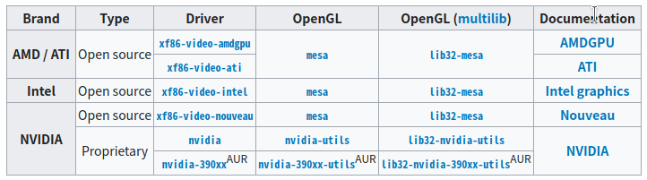

# Arch Linux 安装记录


前几天打开好久没用的电脑，一更新把之前图省事装的 Manjaro 滚挂了，也懒得去解决，于是决定安装一个 Arch Linux ，在这里记录一下安装过程。

本人是非常喜欢 Arch Linux 的，因为其高度自定义化、遵循KISS原则（Keep It Simple, Stupid）、滚动更新并且以用户为中心。但是，由于其理念为以用户为中心但不是用户友好，所以对很多人来说安装 Arch 还是有一定难度的。读者也可以参考本篇教程从零开始安装一个属于自己的 Arch 。

<!--more-->

## 准备

### 安装介质

在安装之前我们需要首先准备一个U盘或者光盘作为安装介质。不过光盘这东西现在应该没人用了吧，那我就以U盘为例了。

1. 下载镜像：[Arch Linux Downloads](https://www.archlinux.org/download/)下载 Arch Linux 镜像。为了提高下载速度，我是在[TUNA](https://mirrors.tuna.tsinghua.edu.cn/archlinux/iso/)（清华大学开源软件镜像站）下载的。
2. 烧录镜像：我是在 Windows 下使用 [Rufus](http://rufus.ie/) 烧录的镜像，当然，也可以使用其他软件。

### 磁盘分区

为了方便我直接在Windows下分好了分区，我的电脑有一块 SSD 和一块机械硬盘，我打算在SSD挂载`/`，在机械硬盘挂载`/home`。所以我分别在两块硬盘的末尾空余出了一段空间，留作Arch使用。

## 开始安装

### U盘启动

在 BIOS 或者 UEFI 中设置U盘为第一启动项，进入 Arch 菜单后选择`Boot Arch Linux (x86_64)`。

### 检查引导方式

可以使用以下命令检查引导方式为 BIOS(LEGACY)+MBR 还是 EFI/GPT 。

```bash
ls /sys/firmware/efi/efivars
```

我的电脑比较旧，仍使用的是 BIOS+MBR 。

### 联网

Arch 是不能离线安装的，必须要连接网络。

- 有线连接：

  ```bash
  dhcpcd
  ```
  
- 无线连接：

  Arch 并不一定能在此时支持所有型号的无线网卡，如果支持的话可以使用以下命令连接 Wifi ：

  ```bash
  wifi-menu
  ```

  如果出现问题的话可以参见：[Network configuration/Wireless](https://wiki.archlinux.org/index.php/Network_configuration/Wireless)

  如果你的无线网卡无法支持，可以使用数据线将手机连接电脑，启用USB网络共享，然后就可以按照有线连接处理了。

### 更新系统时间

执行以下命令：

```bash
timedatectl set-ntp true
```

### 分区与格式化


#### 注意
数据无价，请谨慎操作！


#### 分区

使用以下命令查看目前的分区情况。

```bash
fdisk -l
```

使用以下命令进入交互式分区管理：

```bash
cfdisk /dev/sdx
```

其中的`x`替换为你想要进行分区的硬盘，比如我就需要先执行`cfdisk /dev/sda`来处理 SSD ，然后再执行`cfdisk /dev/sdb`来处理机械硬盘。

分区的过程比较简单，按照界面中的提示来就好，最后不要忘了保存。

分区完成后再执行`fdisk -l`来确认一下分区信息。

#### 格式化

使用以下命令对分区进行格式化：

```bash
mkfs.ext4 /dev/sdxY
```

其中的 x y 替换为需要格式化的分区，比如`mkfs.ext4 /dev/sda1` 。

#### 挂载分区

使用以下命令将根分区挂载到`/mnt`：

```bash
mount /dev/sdxY /mnt
```

如果你像我一样额外创建了`/home`分区，还需要执行以下操作：

```bash
mkdir /mnt/home
mounrt /dev/sdxY /mnt/home
```

### 更换镜像源

为了加快之后的软件包下载速度，我们需要先更换一下默认的镜像源。

编辑`/etc/pacman.d/mirrorlist` 。

```bash
nano /etc/pacman.d/mirrorlist
```

将你需要的镜像源剪切到文件的最上方，第一个镜像源将作为默认镜像源。

对于 nano 编辑器，你可以使用`Ctrl+W`快捷键来搜索，`Alt+W`来继续搜索下一个，`Ctrl+K`来剪切一整行，`Ctrl+U`粘贴，最后使用`Ctrl+X`来退出。

我推荐使用清华、浙大、中科大和网易的源。

```
Server = http://mirrors.tuna.tsinghua.edu.cn/archlinux/$repo/os/$arch
Server = http://mirrors.zju.edu.cn/archlinux/$repo/os/$arch
Server = http://mirrors.ustc.edu.cn/archlinux/$repo/os/$arch
Server = http://mirrors.163.com/archlinux/$repo/os/$arch
```

### 安装基本包

执行以下命令：

```
pacstrap /mnt base base-devel linux linux-firmware dhcpcd
```

其中`base-devel`如果你不使用 AUR 源的话可以不安装。

## 基础配置

### Fstab

使用以下命令生成 [fstab](https://wiki.archlinux.org/index.php/Fstab) 文件：

```bash
genfstab -L /mnt >> /mnt/etc/fstab
```

这步非常重要，决定了你能否正常启动系统，最好检查一下配置的是否正确。

```bash
cat /mnt/etc/fstab
```

### Chroot

[Change root](https://wiki.archlinux.org/index.php/Change_root) 到新安装的系统，自此，我们运行的命令就全部在新的系统而非U盘里的临时系统中运行了：

```bash
arch-chroot /mnt
```

### 配置时区

使用以下命令将时区设置为东八区并生成`/etc/adjtime`文件：

```bash
ln -sf /usr/share/zoneinfo/Asia/Shanghai /etc/localtime
hwclock --systohc
```

### 本地化

首先编辑`/etc/locale.gen`文件，这个文件中应该只有注释，我们需要把要使用的语言反注释（即去掉最前面的`#`），建议只选择带有 UTF-8 的语言，比如：

```bash
nano /etc/locale.gen
```

```
en_US.UTF-8 UTF-8
zh_CN.UTF-8 UTF-8
zh_TW.UTF-8 UTF-8
```

设置完成后，执行`locale-gen`生成 locale 信息。

之后，我们需要编辑`/etc/locale.conf`来设置系统的默认语言。

```bash
/etc/locale.conf
```

然后输入以下内容：

```
LANG=en_US.UTF-8
```


#### 注意
不建议在这里直接设置为`zh_CN.UTF-8` ，会造成 TTY 乱码以及一些log文件输出错误。


### 设置主机名

编辑`/etc/hostname`并在里面输入你的主机名。

然后编辑`/etc/hosts`，输入以下内容（将myhostname替换为你的主机名）：

```
127.0.0.1	localhost
::1			localhost
127.0.1.1	myhostname.localdomain	myhostname
```

### 设置Root密码

为了安全，我们需要为`root`账户设定一个密码，直接输入以下命令，并输入两次**不可见的**密码，就设置好了。

```bash
passwd
```

### 安装引导程序

只有一个系统是无法直接启动的，我们需要安装一个引导程序来启动我们的系统。对于 Linux 最流行的是 Grub2 。

#### 识别其他系统

也许你的电脑中并不是只有 Arch 一个系统，那么我们应该让 Grub2 也能够管理其他系统，我们只需要先安装以下两个包就可以识别已经存在的系统了。

```bash
pacman -S os-prober ntfs-3g
```

#### BIOS/MBR

依次执行以下的命令，来安装 Grub2 启动管理器：

```bash
pacman -S grub
grub-install --target=i386-pc /dev/sdx
grub-mkconfig -o /boot/grub/grub.cfg
```

注意：其中的`sdx`应该是你的`/`（根目录）所在硬盘（不是分区，是硬盘！）。

#### EFI/GPT

依次执行以下的命令，来安装 Grub2 启动管理器：

```bash
pacman -S grub efibootmgr
grub-install --target=x86_64-efi --efi-directory=/boot --bootloader-id=grub
grub-mkconfig -o /boot/grub/grub.cfg
```

#### 检查

为了确保万无一失，我们最好检查以下 Grub 配置是否正确。

```bash
nano /boot/grub/grub.cfg
```

检查是否正确配置了 Arch 启动项以及是否识别到了其他系统。

### 提前安装其他必要软件

在正式进入系统开始配置之前，我们也可以先安装一些必要的软件。

输入以下命令， pacman 会自动帮你处理好依赖等问题并完成安装。

```bash
pacman -S nano vim dialog wpa_supplicant ntfs-3g networkmanager
```

如果你是 Intel CPU 建议额外安装`intel-ucode`来安装 Intel 微代码固件。

```bash
pacman -S intel-ucode
```

### 重启进入系统

至此， Arch Linux 的基本安装和配置就完成了，我们可以重启进入安装好的系统来进行进一步的配置。

首先，退出 Chroot 环境执，行如下命令：

```bash
exit
```

依次卸载硬盘分区：

```bash
umount /mnt/home
umount /mnt
```

最后重启并在关机后拔掉U盘。

```bash
reboot
```

## 安装后的配置

### 创建交换文件

对于现代的操作系统来说，交换文件是一种非常常见的设计，它将在物理内存不足时将部分硬盘空间模拟为内存，避免系统停止工作。在 Linux 中之前常见的做法是划分一个单独的分区作为交换分区，而目前更为便捷的做法是像 Windows 一样创建一个交换文件，方便之后的管理和调整。

首先分配一块空间用于交换文件：

```bash
fallocate -l 512M /swapfile
```

推荐至少要有 4G 大小。

更改权限：

```bash
chmod 600 /swapfile
```

设置交换文件：

```bash
mkswap /swapfile
```

启用交换文件：

```bash
swapon /swapfile
```

最后编辑`/etc/fstab`在开机时挂载交换文件：

```bash
nano /etc/fstab
```

在最底部添加：

```
/swapfile none swap defaults 0 0
```

### 新建用户

直接使用`root`账户作为默认账户是很不安全的，没准手一抖输入了个`rm -rf /`就和全部数据说拜拜了。并且很多软件都是禁止在`root`环境下执行的，比如安装 AUR 源中的软件时必须的`makepkg`命令。所以我们要创建一个低权限账户作为日常使用的账户。使用以下命令创建一个账户：

```bash
useradd -m -G wheel username
```

上面的命令表示创建一个名为 username 的账户，加入 wheel 用户组，并为其创建一个用户主目录`/home/username` 。

之后执行以下命令设置密码。

```bash
passwd username
```

### 配置sudo

如果我们要在低权限账户中执行一些特权操作，该怎么办呢，很简单，直接输入`su`命令即可切换到`root`账户，执行完后再输入`exit`即可返回，但是这样多少有些麻烦，我们可以用`sudo`命令来简化这一步骤。

首先安装`sudo`：

```bash
pacman -S sudo
```

然后为了配置`sudo `，需要先设置一个默认编辑器，比如 nano 或者 vim：

```bash
export EDITOR=nano
export EDITOR=vim
```

然后执行：

```bash
visudo
```

找到`# %wheel ALL=(ALL)ALL`这行，并反注释掉。

这表示允许wheel用户组的全部用户使用`sudo`执行一切命令，当然，需要输入密码。

### 安装图像界面

#### 安装显卡驱动



你可以参照上表安装适合的显卡驱动，比如 Intel 的集成显卡就要安装：

```bash
sudo pacman -S xf86-video-intel
```

#### 安装Xorg

X.Org项目提供了X Window系统的开源实现，是几乎一切桌面用户程序的必备条件。

```bash
sudo pacman -S xorg
```

#### 安装桌面环境

Linux 不像 Windows 或者 MacOS ，它拥有无数不同的桌面环境，这些桌面环境各有特点，从只有窗口管理器的 i3wm 和 Openbox ，到轻量级的 Xfce 、LXDE 和 LXQt、国人开发的 Deepin Desktop Environment ，再到最知名的 GNOME 和 KED ，可以说是数不胜数。其中我最喜欢的是 KED(Plasma)，它几乎不需要怎么配置就有着非常棒的显示效果，可定制项多，自带的工具也非常的齐全方便。所以接下来就以它为例。

准确来说 KED 并不是一个桌面环境，而是一个由 Plasma 桌面环境、库、框架 (KDE Frameworks)和应用组成的软件项目，包含了大量应用程序。其中桌面环境叫做 Plasma ，而其他应用程序可以在 [kde-applications](https://www.archlinux.org/groups/x86_64/kde-applications/) 包组中找到。

你可以直接执行以下命令来安装它们全部：

```bash
sudo pacman -S plasma kde-applications
```

不过我觉得这有点太重了，kde-applications 中有不少软件我是用不上的。所以我选择了只安装 plasma ，再手动安装其他需要的软件。我安装的程序主要如下：

```
sudo pacman -S plasma ark dolphin gwenview kdf konsole spectacle yakuake
```

它们依次是桌面环境、压缩包管理器、文件管理器、图像查看器、磁盘空间查看器、终端模拟器、截图工具、下拉式终端。

#### 安装显示管理器

显示管理器可以帮助我们不需要每次手动启动桌面环境，图形化完成登录等操作。最常用的显示管理器是 SDDM（也是KED的默认显示管理器）。

```bash
sudo pacman -S sddm
```

安装完成后我们需要让它开机自动启动：

```bash
sudo systemctl enable sddm
```

#### 重启进入图形化界面

最后我们只要运行`reboot`重启即可进入图形化界面了！

## 开始使用

### 配置 pacman

pacman 是 Arch 默认的包管理器，它有许多可自定义的选项，可以通过编辑`/etc/pacman.conf`进行修改，我进行的配置如下：

-  启用彩色输出：反注释`Color`
-  升级前对比版本：反注释`VerbosePkgLists`

### 使用 ArchlinuxCN

Arch Linux 中文社区仓库 是由 Arch Linux 中文社区驱动的非官方用户仓库。包含中文用户常用软件、工具、字体/美化包等。我们可以通过编辑 `/etc/pacman.conf` 来添加它。

在 `/etc/pacman.conf` 文件末尾添加以下两行：

```
[archlinuxcn]
Server = https://repo.archlinuxcn.org/$arch
```

或者也可以使用清华大学开源软件镜像站提供的镜像：

```
[archlinuxcn]
Server = https://mirrors.tuna.tsinghua.edu.cn/archlinuxcn/$arch
```

之后安装 `archlinuxcn-keyring` 包导入 GPG key。


如果安装 `archlinuxcn-keyring ` 失败的话可以在`/etc/pacman.conf`最后面添加：

```
SigLevel = Optional TrustAll
```



### 使用 AUR

[Arch 用户软件仓库](https://aur.archlinux.org/)（Arch User Repository，AUR）是为用户而建、由用户主导的 Arch 软件仓库。提供了大量官方包之外的软件包，可以说它是 Arch 的灵魂之一，几乎所有 Linux 上有的软件都可以在它里面找到。

要安装 AUR 中的软件，基本操作是在 [AUR](https://aur.archlinux.org/) 中搜索软件，然后使用`git`克隆源码，再使用`makepkg`生成安装包，最后使用`pacman -U xxx.tar.gz`安装包。这显然是很麻烦的，所以我们可以使用一些 AUR 助手（AUR helpers）来帮助我们安装，目前最为常用的是 yay 。

如果你添加了 ArchlinuxCN 源的话可以直接安装 yay 。

```bash
sudo pacman -S yay
```

否则需要手动安装：

```bash
git clone https://aur.archlinux.org/yay-bin.git
cd yay
makepkg -si
```

`yay` 兼容所有 `pacman` 的命令行，你可以直接像使用`pacman`一样使用它。

如果 AUR 源访问较慢，也可以使用以下命令切换到清华大学开源软件镜像站提供的镜像源。

```bash
yay --aururl "https://aur.tuna.tsinghua.edu.cn" --save
```

### 安装中文字体

中文字体有很多种，常用的有文泉驿的开源字体和 Google 的 noto 字体，我使用的是noto 字体。

```bash
sudo pacman -S noto-fonts noto-fonts-cjk noto-fonts-emoji
```

如果你在安装后发现部分界面字形为异体（日文）字形，可以参考 [修正简体中文显示为异体（日文）字形](https://wiki.archlinux.org/index.php/Localization/Simplified_Chinese_(%E7%AE%80%E4%BD%93%E4%B8%AD%E6%96%87)#%E4%BF%AE%E6%AD%A3%E7%AE%80%E4%BD%93%E4%B8%AD%E6%96%87%E6%98%BE%E7%A4%BA%E4%B8%BA%E5%BC%82%E4%BD%93%EF%BC%88%E6%97%A5%E6%96%87%EF%BC%89%E5%AD%97%E5%BD%A2)。

### 安装中文输入法

中文输入法可以直接使用搜狗输入法。

如果添加了 ArchlinuxCN 源的话可以直接执行以下命令安装：

```bash
sudo pacman -S fcitx-lilydjwg-git fcitx-sogoupinyin fcitx-qt5
```

如果是KDE桌面环境的话还应该安装：

```bash
sudo pacman -S kcm-fcitx
```

安装完成后需要修改`/etc/profile`文件，在文件开头添加：

```
export XMODIFIERS="@im=fcitx"
export GTK_IM_MODULE="fcitx"
export QT_IM_MODULE="fcitx"
```

## 软件推荐

最后再来推荐一些我常用的软件吧。

### Zsh

Bash 的替代者，支持丰富的插件和主题，可以说是最好的 Shell 之一。

配合 Oh My Zsh 和 Powerlevel10k 主题简直好用到飞起！

```bash
sudo pacman -S zsh oh-my-zsh-git zsh-autosuggestions zsh-syntax-highlighting zsh-theme-powerlevel10k
```

我常用的的插件如下：

```
plugins=(git sudo sublime colored-man-pages pip command-not-found safe-paste extract z wd archlinux zsh-autosuggestions zsh-syntax-highlighting)
```

### 办公

- Markdown 编辑器：Typora
- Office：WPS
- 思维导图：XMind Zen
- 笔记：Leanote

### 互联网

- 浏览器：Chrome
- 浏览器：FireFox
- 下载：uGet
- 下载：Aria2
- 比特币钱包：Electron
- 网络抓包：Wireshark
- 云盘：坚果云

### 影音图像

- 图像处理：GIMP
- 视频播放器：VLC

### 文字编辑

- Sublime Text
- Atom
- Visual Studio Code

## 参考

- [Arch Linux Wiki Installation guide](https://wiki.archlinux.org/index.php/Installation_guide_(%E7%AE%80%E4%BD%93%E4%B8%AD%E6%96%87))
- [Arch Linux Wiki General recommendations](https://wiki.archlinux.org/index.php/General_recommendations_(%E7%AE%80%E4%BD%93%E4%B8%AD%E6%96%87))
- [以官方Wiki的方式安装ArchLinux](https://www.viseator.com/2017/05/17/arch_install/)
- [ArchLinux安装后的必须配置与图形界面安装教程](https://www.viseator.com/2017/05/19/arch_setup/)
- [Arch Linux上搜狗输入法无法输入的解决方法](https://zhuanlan.zhihu.com/p/74931620)


